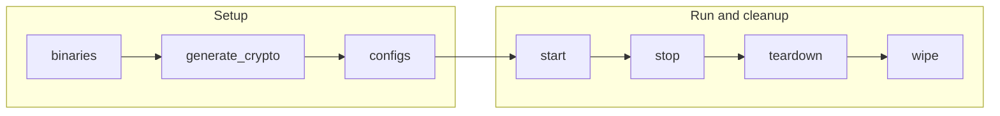

# Semaphore UI Playbooks

The `semaphore_ui` playbooks operate Semaphore UI, an automation controller run as a binary on its own control node so this collection's playbooks and inventories can be launched from a web UI. They target `semaphore_ui` by default.

## Table of Contents <!-- omit in toc -->

- [Playbooks flow](#playbooks-flow)
- [binaries.yaml](#binariesyaml)
- [generate\_crypto.yaml](#generate_cryptoyaml)
- [configs.yaml](#configsyaml)
- [start.yaml](#startyaml)
- [stop.yaml](#stopyaml)
- [teardown.yaml](#teardownyaml)
- [wipe.yaml](#wipeyaml)
- [ping.yaml](#pingyaml)
- [fetch\_logs.yaml](#fetch_logsyaml)

## Playbooks flow



## binaries.yaml

[`binaries.yaml`](./binaries.yaml) downloads and extracts the platform-matched Semaphore UI release archive, unless the binary is already installed.

```shell
ansible-playbook hyperledger.fabricx.semaphore_ui.binaries --extra-vars '{"target_hosts": "semaphore_ui"}'
```

Properties:

- Target hosts: `semaphore_ui` by default.

## generate_crypto.yaml

[`generate_crypto.yaml`](./generate_crypto.yaml) generates a self-signed TLS certificate for Semaphore UI's own native HTTPS listener, when `semaphore_ui_use_tls: true`.

```shell
ansible-playbook hyperledger.fabricx.semaphore_ui.generate_crypto --extra-vars '{"target_hosts": "semaphore_ui"}'
```

Properties:

- Target hosts: `semaphore_ui` by default.
- Nuance: a no-op when `semaphore_ui_use_tls` is unset or `false`.

## configs.yaml

[`configs.yaml`](./configs.yaml) renders the Semaphore UI server configuration and the Fabric-X project seed file, then runs database migrations and ensures the admin user and the Fabric-X project — one repository, one inventory per supported example family, and one task template per supported example playbook — exist.

```shell
ansible-playbook hyperledger.fabricx.semaphore_ui.configs --extra-vars '{"target_hosts": "semaphore_ui"}'
```

Properties:

- Target hosts: `semaphore_ui` by default. Run after `generate_crypto` and before `start`. Does not touch the database; `start` handles migrating and seeding it.
- Nuance: the repository is seeded as a `local` repository pointing at this collection's own checkout (`project_dir`), which Semaphore UI runs in place instead of cloning — the reason artifacts under `out/control-node/` persist across runs.
- Nuance: every seeded task template sets `skip_galaxy_install: true` and this must never be changed: Semaphore UI otherwise runs `ansible-galaxy` against this repository's own `requirements.yml` and `collections/requirements.yml` before each run, which would reinstall this very collection from Git over the checkout it is running from.
- Nuance: `semaphore_ui_inventories`/`semaphore_ui_job_templates` are not discovered automatically; they are kept in sync by hand with `examples/inventory`/`examples/playbooks` in `roles/semaphore_ui/meta/argument_specs.yaml`.

## start.yaml

[`start.yaml`](./start.yaml) migrates and seeds the Semaphore UI database if it does not exist yet, starts the Semaphore UI binary in a tmux session, and waits for its web port to become reachable.

```shell
ansible-playbook hyperledger.fabricx.semaphore_ui.start --extra-vars '{"target_hosts": "semaphore_ui"}'
```

Properties:

- Target hosts: `semaphore_ui` by default.

## stop.yaml

[`stop.yaml`](./stop.yaml) stops the tmux session running Semaphore UI, leaving its data, configuration, and installed binary in place.

```shell
ansible-playbook hyperledger.fabricx.semaphore_ui.stop --extra-vars '{"target_hosts": "semaphore_ui"}'
```

Properties:

- Target hosts: `semaphore_ui` by default.

## teardown.yaml

[`teardown.yaml`](./teardown.yaml) stops Semaphore UI and removes its data directory (SQLite database, scratch space, and generated secrets), leaving the installed binary and rendered configuration files in place.

```shell
ansible-playbook hyperledger.fabricx.semaphore_ui.teardown --extra-vars '{"target_hosts": "semaphore_ui"}'
```

Properties:

- Target hosts: `semaphore_ui` by default.

## wipe.yaml

[`wipe.yaml`](./wipe.yaml) runs the `teardown` tasks and then also removes the installed binary and the rendered configuration files.

```shell
ansible-playbook hyperledger.fabricx.semaphore_ui.wipe --extra-vars '{"target_hosts": "semaphore_ui"}'
```

Properties:

- Target hosts: `semaphore_ui` by default.

## ping.yaml

[`ping.yaml`](./ping.yaml) checks whether `semaphore_ui_port` is reachable on the managed host, without failing the play.

```shell
ansible-playbook hyperledger.fabricx.semaphore_ui.ping --extra-vars '{"target_hosts": "semaphore_ui"}'
```

Properties:

- Target hosts: `semaphore_ui` by default.

## fetch_logs.yaml

[`fetch_logs.yaml`](./fetch_logs.yaml) fetches the Semaphore UI log file from the managed host into the configured output directory, without failing if the file is absent.

```shell
ansible-playbook hyperledger.fabricx.semaphore_ui.fetch_logs --extra-vars '{"target_hosts": "semaphore_ui"}'
```

Properties:

- Target hosts: `semaphore_ui` by default.
