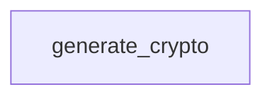

# YugabyteDB Playbooks

The `yugabyte` playbooks provide standalone YugabyteDB crypto generation helpers. Normal YugabyteDB lifecycle operations for committer-backed deployments are invoked through the [committer playbooks](../committer/README.md).

## Table of Contents <!-- omit in toc -->

- [Playbooks flow](#playbooks-flow)
- [generate\_crypto.yaml](#generate_cryptoyaml)

## Playbooks flow



## generate_crypto.yaml

[`generate_crypto.yaml`](./generate_crypto.yaml) handles the standalone OpenSSL-based TLS path for YugabyteDB clusters. It creates a self-signed cluster CA on the control node, generates node CSRs on YugabyteDB hosts, fetches those CSRs for signing, writes node certificates, and transfers the signed TLS material back to the matching YugabyteDB nodes.

=== "Command line"

    ```shell
    ansible-playbook hyperledger.fabricx.yugabyte.generate_crypto --extra-vars '{"target_hosts": "fabric_x_committer"}'
    ```

=== "From a playbook"

    ```yaml
    - name: Run yugabyte generate-crypto playbook
      vars:
        target_hosts: fabric_x_committer
      ansible.builtin.import_playbook: hyperledger.fabricx.yugabyte.generate_crypto
    ```

Properties:

- Target hosts: `all` by default for the YugabyteDB host phases, plus `localhost` for CA generation and certificate signing. Use `target_hosts` to restrict the YugabyteDB nodes.
- Nuance: only hosts that define `yugabyte_component_type` participate in the node-side CSR and transfer steps. The TLS CA is grouped by `yugabyte_cluster_id` and organization metadata.
