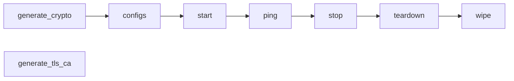

# YugabyteDB Playbooks

The `yugabyte` playbooks operate YugabyteDB clusters shared across the network. A cluster backs the committer, so every lifecycle playbook here targets `all` and selects hosts by inventory variable rather than by group. A standalone OpenSSL-based TLS CA path is also provided for clusters that don't tie their TLS into the Fabric-X organization PKI.

## Table of Contents <!-- omit in toc -->

- [Playbooks flow](#playbooks-flow)
- [generate\_crypto.yaml](#generate_cryptoyaml)
- [configs.yaml](#configsyaml)
- [start.yaml](#startyaml)
- [stop.yaml](#stopyaml)
- [teardown.yaml](#teardownyaml)
- [wipe.yaml](#wipeyaml)
- [ping.yaml](#pingyaml)
- [generate\_tls\_ca.yaml](#generate_tls_cayaml)

## Playbooks flow


```mermaid
flowchart LR
  CRYPTO[generate_crypto] --> CONFIGS[configs]
  CONFIGS --> START[start]
  START --> PING[ping]
  PING --> STOP[stop]
  STOP --> TEARDOWN[teardown]
  TEARDOWN --> WIPE[wipe]
  TLSCA[generate_tls_ca]
```

## generate_crypto.yaml

[`generate_crypto.yaml`](./generate_crypto.yaml) generates TLS crypto material for every YugabyteDB node in the inventory: cryptogen transfer or Fabric CA enrollment depending on inventory configuration. Nodes enrolling through Fabric CA require a reachable, already-started Fabric CA server.

```shell
ansible-playbook hyperledger.fabricx.yugabyte.generate_crypto --extra-vars '{"target_hosts": "all"}'
```

Properties:

- Target hosts: `all` by default. Use `target_hosts` to restrict to a subset.
- Nuance: only hosts that define `yugabyte_component_type` participate.

## configs.yaml

[`configs.yaml`](./configs.yaml) transfers YugabyteDB configuration files (the cluster init script, Kubernetes ConfigMaps) for every node in the inventory.

```shell
ansible-playbook hyperledger.fabricx.yugabyte.configs --extra-vars '{"target_hosts": "all"}'
```

Properties:

- Target hosts: `all` by default.
- Nuance: only hosts that define `yugabyte_component_type` participate.

## start.yaml

[`start.yaml`](./start.yaml) starts every YugabyteDB node in the inventory, master nodes before tablet servers within each cluster. Run it before starting the committer.

```shell
ansible-playbook hyperledger.fabricx.yugabyte.start --extra-vars '{"target_hosts": "all"}'
```

Properties:

- Target hosts: `all` by default. Use `target_hosts` to restrict to a subset.
- Nuance: only hosts that define `yugabyte_component_type` participate; every other host is skipped. Nodes are grouped into their cluster by `yugabyte_cluster_id`.

## stop.yaml

[`stop.yaml`](./stop.yaml) stops every YugabyteDB node in the inventory. Run it after stopping the committer.

```shell
ansible-playbook hyperledger.fabricx.yugabyte.stop --extra-vars '{"target_hosts": "all"}'
```

Properties:

- Target hosts: `all` by default.
- Nuance: only hosts that define `yugabyte_component_type` participate.

## teardown.yaml

[`teardown.yaml`](./teardown.yaml) removes runtime state for every YugabyteDB node in the inventory. Run it after tearing down the committer and before removing container networks.

```shell
ansible-playbook hyperledger.fabricx.yugabyte.teardown --extra-vars '{"target_hosts": "all"}'
```

Properties:

- Target hosts: `all` by default.
- Nuance: only hosts that define `yugabyte_component_type` participate.

## wipe.yaml

[`wipe.yaml`](./wipe.yaml) removes all YugabyteDB artifacts, including generated configuration and crypto, from every node in the inventory.

```shell
ansible-playbook hyperledger.fabricx.yugabyte.wipe --extra-vars '{"target_hosts": "all"}'
```

Properties:

- Target hosts: `all` by default.
- Nuance: only hosts that define `yugabyte_component_type` participate.

## ping.yaml

[`ping.yaml`](./ping.yaml) checks that every YugabyteDB node port in the inventory is reachable. Run it before pinging the committer.

```shell
ansible-playbook hyperledger.fabricx.yugabyte.ping --extra-vars '{"target_hosts": "all"}'
```

Properties:

- Target hosts: `all` by default.
- Nuance: only hosts that define `yugabyte_component_type` participate.

## generate_tls_ca.yaml

[`generate_tls_ca.yaml`](./generate_tls_ca.yaml) handles the standalone OpenSSL-based TLS path for YugabyteDB clusters, for deployments that don't tie YugabyteDB's TLS into the Fabric-X organization PKI. It creates a self-signed cluster CA on the control node, generates node CSRs on YugabyteDB hosts, fetches those CSRs for signing, writes node certificates, and transfers the signed TLS material back to the matching YugabyteDB nodes.

```shell
ansible-playbook hyperledger.fabricx.yugabyte.generate_tls_ca --extra-vars '{"target_hosts": "fabric_x_committers"}'
```

Properties:

- Target hosts: `all` by default for the YugabyteDB host phases, plus `localhost` for CA generation and certificate signing. Use `target_hosts` to restrict the YugabyteDB nodes.
- Nuance: only hosts that define `yugabyte_component_type` participate in the node-side CSR and transfer steps. The TLS CA is grouped by `yugabyte_cluster_id` and organization metadata.
